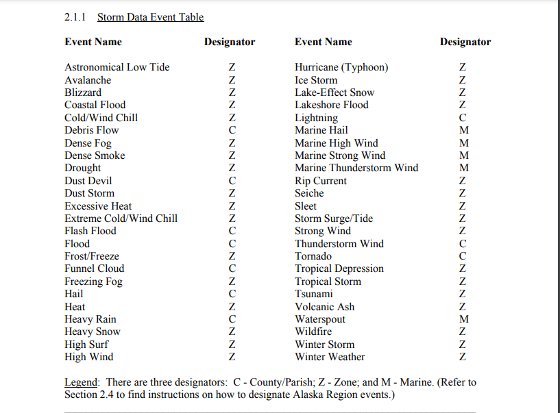

# Synopsis

# Data Processing
  ```{r setup, include=FALSE}
knitr::opts_chunk$set(echo = TRUE)
```
This section contains the R code to load the libraries, open the dataset, examine the dataset's `EVTYPE` column, and correct those as necessary.

First install the required libraries if needed, and load them.
```{r, loadLibs, results='hide'} 

if(!require("dplyr")) {
  install.packages("dplyr")
}
library(dplyr)

if(!require("R.utils")) {
  install.packages("R.utils")
}

if(!require("data.table")) {
  install.packages("data.table")
}
library(data.table)

if(!require("knitr")) {
  install.packages("knitr")
}
library(knitr)

if(!require("ggplot2")) {
  install.packages("ggplot2")
}
library(ggplot2)

if(!require("grid")) {
  install.packages("grid")
}
library(grid)

if(!require("gridExtra")) {
  install.packages("gridExtra")
}
library(gridExtra)

if(!require("numform")) {
  install.packages("numform")
}
library(numform)
```
Open the database, downloading it if it isn't in the current directory.
```{r}
if (!file.exists("StormData.bz2")) {
     message("Downloading dataset")
     download.file("http://d396qusza40orc.cloudfront.net/repdata%2Fdata%2FStormData.csv.bz2",
     destfile = "StormData.bz2", 
     method   = "internal",
     mode     = "wb")
}
```
```{r loadData, cache=TRUE}
message("Loading dataset. This could take a while…")
stormData <- fread("StormData.bz2")
```
Function to convert the one-character PROPDMGEXP or CROPDMGEXP to
a power of ten. This function will be used later to create `PropertyDamage` and `CropDamage` columns by multiplying with `PROPDMG` and `CROPDMG`.
```{r damageMultiplier}
damageMultiplier <- function(xponent) {
  return(switch(toupper(xponent),
                "?" = 1,
                "1" = 1,
                "2" = 10,
                "3" = 100,
                "4" = 1e+03,
                "5" = 1e+04,
                "6" = 1e+05,
                "7" = 1e+06,
                "8" = 1e+07,
                "H" = 100,
                "K" = 1000,
                "M" = 1e+06,
                "B" = 1e+09,
                1))
}
```

Extract only the relevant columns, then exclude rows with zero values for INJURIES, FATALITIES, PROPDMG, *and* CROPDMG.
```{r, extractColumns}
colsOfInterest <- stormData[, c('EVTYPE', 
                                'FATALITIES', 
                                'INJURIES', 
                                'PROPDMG', 
                                'PROPDMGEXP', 
                                'CROPDMG', 
                                'CROPDMGEXP')] %>%
                                subset(!(INJURIES == 0 & FATALITIES == 0 & PROPDMG == 0 & CROPDMG == 0))
```

`subset()`ing reduces the size of the dataset from `r f_comma(dim(stormData)[1], mark = ",")` to `r 
f_comma(dim(colsOfInterest)[1], mark = ",")` rows.

Remove leading and trailing spaces from `EVTYPE`, create new columns for Property and Crop Damage by multiplying `PROPDMG` and `CROPDMG`, respectively, by `damageMultiplier()`
```{r, createNewCols}
colsOfInterest <- colsOfInterest %>%
  mutate("EVTYPE"         = toupper(trimws(colsOfInterest$EVTYPE, "b")))  %>%
  mutate("PropertyDamage" = colsOfInterest$PROPDMG * mapply(damageMultiplier, colsOfInterest$PROPDMGEXP)) %>%
  mutate("CropDamage"     = colsOfInterest$CROPDMG * mapply(damageMultiplier, colsOfInterest$CROPDMGEXP))
```

A cursory examination of the original `StormData` dataset reveals non-standard entries in the `EVTYPE` column, e.g., misspellings, or leading or trailing spaces. The `trimws()` function above takes care of the latter. As to the other issues: according to the National Weather Service [Storm Data Documentation](https://d396qusza40orc.cloudfront.net/repdata%2Fpeer2_doc%2Fpd01016005curr.pdf), there are 48 standard Event Types. However, the dataset contains `r f_comma(length(unique(colsOfInterest$EVTYPE)), mark = ",")` unique `EVTYPE` entries.

Below is the table from the aforementioned NWS documentation:


And here are the first 20 entries of the `EVTYPE` column with "HURRICANE" entries:
```{r exploreHurricane}
head(colsOfInterest[grep("HURRICANE*", colsOfInterest$EVTYPE), "EVTYPE"], 20)
```

And for "FLOOD" entries:
```{r exploreFlood}
head(colsOfInterest[grep("*FLOOD*", colsOfInterest$EVTYPE), "EVTYPE"], 20)
```

This points to the need to clean up the dataset, by modifying the `EVTYPE` entries to conform to the standard events.

Standardizing the `EVTYPE` entries in `stormData` entails four steps:

1. Creating a new dataset consisting of the standard event types.

1. Extracting the event types from the aforementioned PDF. The library [`tabulizer`](https://cran.r-project.org/package=tabulizer) is supposed to facilitate this. Unfortunately, it wouldn't install on my R, so I had to copy-and-paste. Fortunately, the paste resulted in a single column, so it was easy to import it as a dataset.

1. Next up, get rid of the C, M, and Z designations. `gsub()` will do the job.

1. Replace the `EVTYPE`s with the standard event types.

```{r}
if (!file.exists("eventTypes.text")){
  stop("Please create file of standard Event Types")
}
```

Read in the text file, remove the designators, and convert the entries to uppercase. 
```{r, validEvents}
validEvents <- read.csv("eventTypes.text", header = FALSE)
validEvents <- gsub(pattern = " [CMZ]$", 
                    replacement = "", 
                    x = validEvents$V1)
validEvents <- toupper(validEvents)
```

Check the non-standard `EVTYPE`s
```{r checkEVTYPEs}
invalidEvents <- subset(colsOfInterest, !(colsOfInterest$EVTYPE %in% validEvents))
invalidEvents <- unique(invalidEvents)
sprintf("Number of unique non-standard EVTYPEs: %s.", f_comma(length(invalidEvents$EVTYPE)))
```
It's not as formidable as it looks, though. Consider that there are  `r dim(unique(colsOfInterest[grep("*HURRICANE*", colsOfInterest$EVTYPE)]))[1]` and `r f_comma(dim(unique(colsOfInterest[grep("*FLOOD*", colsOfInterest$EVTYPE)]))[1], mark = ",")` occurrences of "HURRICANE" and "FLOOD", respectively, in the reduced dataset. This means that those `EVTYPE`s can be transformed using only one statement each.

Modify the `EVTYPE` columns to conform with `validEvents`.
(Credit to [Mauro Taraborelli](https://www.maurotaraborelli.com/projects/reproducible-research-assignment-2/) for the grep patterns.)
```{r, cleanEVTYPE}
colsOfInterest <- colsOfInterest %>% 
  mutate("EVTYPE" = gsub("^(SMALL )?HAIL.*", "HAIL", EVTYPE)) %>%
  mutate("EVTYPE" = gsub("TSTM|THUNDERSTORMS?", "THUNDERSTORM", EVTYPE)) %>%
  mutate("EVTYPE" = gsub("STORMS?", "STORM", EVTYPE)) %>%
  mutate("EVTYPE" = gsub("STORMS?", "STORM", EVTYPE)) %>%
  mutate("EVTYPE" = gsub("WINDS?|WINDS?/HAIL", "WIND", EVTYPE)) %>%
  mutate("EVTYPE" = gsub("RAINS?", "RAIN", EVTYPE)) %>%
  mutate("EVTYPE" = gsub("^TH?UN?DEE?RS?TO?RO?M ?WIND.*|^(SEVERE )?THUNDERSTORM$|^WIND STORM$|^(DRY )?MI[CR][CR]OBURST.*|^THUNDERSTORMW$", "THUNDERSTORM WIND", EVTYPE)) %>%
  mutate("EVTYPE" = gsub("^COASTAL ?STORM$|^MARINE ACCIDENT$", "MARINE THUNDERSTORM WIND", EVTYPE)) %>%
  mutate("EVTYPE" = gsub("^FLOODS?.*|^URBAN/SML STREAM FLD$|^(RIVER|TIDAL|MAJOR|URBAN|MINOR|ICE JAM|RIVER AND STREAM|URBAN/SMALL STREAM)? FLOOD(ING)?S?$|^HIGH WATER$|^URBAN AND SMALL STREAM FLOODIN$|^DROWNING$|^DAM BREAK$", "FLOOD", EVTYPE)) %>% 
  mutate("EVTYPE" = gsub("^FLASH FLOOD.*|^RAPIDLY RISING WATER$", "FLASH FLOOD", EVTYPE)) %>%
  mutate("EVTYPE" = gsub("WATERSPOUTS?", "WATERSPOUT", EVTYPE)) %>%
  mutate("EVTYPE" = gsub("WEATHER/MIX", "WEATHER", EVTYPE))  %>%
  mutate("EVTYPE" = gsub("CURRENTS?", "CURRENT", EVTYPE)) %>%
  mutate("EVTYPE" = gsub("^WINDCHILL$|^COLD.*|^LOW TEMPERATURE$|^UNSEASONABLY COLD$", "COLD/WIND CHILL", EVTYPE)) %>%
  mutate("EVTYPE" = gsub("^EXTREME WIND ?CHILL$|^(EXTENDED|EXTREME|RECORD)? COLDS?$", "EXTREME COLD/WIND CHILL", EVTYPE)) %>%
  mutate("EVTYPE" = gsub("^WILD/FOREST FIRE$|^(WILD|BRUSH|FOREST)? ?FIRES?$", "WILDFIRE", EVTYPE)) %>%
  mutate("EVTYPE" = gsub("^RAIN/SNOW$|^(BLOWING|HEAVY|EXCESSIVE|BLOWING|ICE AND|RECORD)? ?SNOWS?.*", "HEAVY SNOW", EVTYPE)) %>%
  mutate("EVTYPE" = gsub("^FOG$", "DENSE FOG", EVTYPE)) %>%
  mutate("EVTYPE" = gsub("^(GUSTY|NON-SEVERE|NON ?-?THUNDERSTORM)? ?WIND.*|^ICE/STRONG WIND$", "STRONG WIND", EVTYPE)) %>%
  mutate("EVTYPE" = gsub("SURGE$", "SURGE/TIDE", EVTYPE)) %>%
  mutate("EVTYPE" = gsub("CLOUDS?", "CLOUD", EVTYPE)) %>%
  mutate("EVTYPE" = gsub("^FROST[/\\]FREEZE$|^FROST$|^(DAMAGING)? ?FREEZE$|^HYP[OE]R?THERMIA.*|^ICE$|^(ICY|ICE) ROADS$|^BLACK ICE$|^ICE ON ROAD$", "FROST/FREEZE", EVTYPE)) %>%
  mutate("EVTYPE" = gsub("^GLAZE.*|^FREEZING (RAIN|DRIZZLE|RAIN/SNOW|SPRAY$)$|^WINTRY MIX$|^MIXED PRECIP(ITATION)?$|^WINTER WEATHER MIX$|^LIGHT SNOW$|^FALLING SNOW/ICE$|^SLEET.*", "SLEET", EVTYPE)) %>%
  mutate("EVTYPE" = gsub("^HURRICANE.*", "HURRICANE (TYPHOON)", EVTYPE)) %>%
  mutate("EVTYPE" = gsub("^HEAT WAVES?$|^UNSEASONABLY WARM$|^WARM WEATHER$", "HEAT", EVTYPE)) %>%
  mutate("EVTYPE" = gsub("^(EXTREME|RECORD/EXCESSIVE|RECORD) HEAT$", "EXCESSIVE HEAT", EVTYPE)) %>%
  mutate("EVTYPE" = gsub("^HEAVY SURF(/HIGH SURF)?.*$|^(ROUGH|HEAVY) SEAS?.*|^(ROUGH|ROGUE|HAZARDOUS) SURF.*|^HIGH WIND AND SEAS$|^HIGH SURF.*", "HIGH SURF", EVTYPE)) %>%
  mutate("EVTYPE" = gsub("^LAND(SLUMP|SLIDE)?S?$|^MUD ?SLIDES?$|^AVALANCH?E$", "AVALANCHE", EVTYPE)) %>%
  mutate("EVTYPE" = gsub("^LAND(SLUMP|SLIDE)?S?$|^MUD ?SLIDES?$|^AVALANCH?E$", "AVALANCHE", EVTYPE)) %>%
  mutate("EVTYPE" = gsub("^UNSEASONABLY WARM AND DRY$|^DROUGHT.*|^HEAT WAVE DROUGHT$", "DROUGHT", EVTYPE)) %>%
  mutate("EVTYPE" = gsub("^TORNADO.*", "TORNADO", EVTYPE)) %>%
  mutate("EVTYPE" = gsub("^TROPICAL STORM.*", "TROPICAL STORM", EVTYPE)) %>%
  mutate("EVTYPE" = gsub("^MARINE MISHAP$|^HIGH WIND/SEAS$", "MARINE HIGH WIND", EVTYPE)) %>%
  mutate("EVTYPE" = gsub("^HIGH WIND.*", "HIGH WIND", EVTYPE)) %>%
  mutate("EVTYPE" = gsub("^HIGH SEAS$", "MARINE STRONG WIND", EVTYPE)) %>%
  mutate("EVTYPE" = gsub("^RIP CURRENT.*", "RIP CURRENT", EVTYPE)) %>%
  mutate("EVTYPE" = gsub("^WATERSPOUT.*", "WATERSPOUT", EVTYPE)) %>%
  mutate("EVTYPE" = gsub("^EXCESSIVE RAINFALL$|^RAIN.*|^TORRENTIAL RAINFALL$|^(HEAVY|HVY)? (RAIN|MIX|PRECIPITATION).*", "HEAVY RAIN", EVTYPE)) %>%
  mutate("EVTYPE" = gsub("^FOG.*", "FREEZING FOG", EVTYPE)) %>%
  mutate("EVTYPE" = gsub("^WINTER STORM.*", "WINTER STORM", EVTYPE)) %>%
  mutate("EVTYPE" = gsub("^THUNDERSNOW$|^ICE STORM.*", "ICE STORM", EVTYPE)) %>%
  mutate("EVTYPE" = gsub("WAVES?|SWELLS?", "SURF", EVTYPE)) %>%
  mutate("EVTYPE" = gsub("^LIGHTNING.*", "LIGHTNING", EVTYPE)) %>%
  mutate("EVTYPE" = gsub("^WHIRLWIND$|^GUSTNADO$|^TORNDAO$", "TORNADO", EVTYPE)) %>%
  mutate("EVTYPE" = gsub("^COASTAL FLOOD.*", "COASTAL FLOOD", EVTYPE)) %>%
  mutate("EVTYPE" = gsub("^TYPHOON", "HURRICANE/TYPHOON", EVTYPE)) %>%
  mutate("EVTYPE" = gsub("^EROSION/CSTL FLOOD$|^COASTAL FLOOD/EROSION$|^COASTAL SURGE/TIDE$", "COASTAL FLOOD", EVTYPE)) %>%
  mutate("EVTYPE" = gsub("^ASTRONOMICAL HIGH TIDE$", "STORM SURGE/TIDE", EVTYPE)) %>%
  mutate("EVTYPE" = gsub("^(GROUND)? ?BLIZZARD.*$", "BLIZZARD", EVTYPE)) %>%
  mutate("EVTYPE" = gsub("^DUST STORM.*$", "DUST STORM", EVTYPE))
```

Check the non-standard `EVTYPE`s again
```{r recheckEVTYPEs}
invalidEvents <- subset(colsOfInterest, !(colsOfInterest$EVTYPE %in% validEvents))
invalidEvents <- unique(invalidEvents)
```
There are still `r f_comma(length(invalidEvents$EVTYPE))` in the dataset, although that shouldn't matter much.

Now that we have standard `EVTYPE`s, we can proceed.

# Results

Compute the total injuries, fatalities, property damage, and crop damage per event type.
```{r aggregateDamage}
allDamage <- aggregate(cbind(INJURIES, FATALITIES, PropertyDamage, CropDamage) ~ EVTYPE, 
                       colsOfInterest, sum)
```

Examine the top rows per impact type.
```{r top10}
top10Injure <- head(allDamage[order(allDamage$INJURIES, decreasing = TRUE), c("EVTYPE", "INJURIES")], 10)
top10Fatal  <- head(allDamage[order(allDamage$FATALITIES, decreasing = TRUE), c("EVTYPE", "FATALITIES")], 10)
top10Prop   <- head(allDamage[order(allDamage$PropertyDamage, decreasing = TRUE), c("EVTYPE", "PropertyDamage")], 10)
top10Crop   <- head(allDamage[order(allDamage$CropDamage, decreasing = TRUE), c("EVTYPE", "CropDamage")], 10)
top10Injure
top10Fatal
top10Prop
top10Crop
```
Create the plots.
```{r createPlots}

injurePlot <- ggplot(top10Injure, aes(x = EVTYPE, y = INJURIES)) +
  geom_bar(stat = "identity", position = "dodge") +
  labs(x = "Event type") +
  theme(axis.text.x = element_text(angle = 90))

fatalPlot <- ggplot(top10Fatal, aes(x = EVTYPE, y = FATALITIES)) + 
  geom_bar(stat = "identity", position = "dodge") + 
  labs(x = "Event type") + 
  theme(axis.text.x = element_text(angle = 90))

cropPlot <- ggplot(top10Crop, aes(x = EVTYPE, y = CropDamage/1000000000)) + 
  geom_bar(stat = "identity", position = "dodge") + 
  labs(x = "Event type", y = "Crop Damage") + 
  theme(axis.text.x = element_text(angle = 90))

propPlot <- ggplot(top10Prop, aes(x = EVTYPE, y = PropertyDamage/1000000000)) + 
  geom_bar(stat = "identity", position = "dodge") + 
  labs(x = "Event type", y = "Property Damage") + 
  theme(axis.text.x = element_text(angle = 90))

grid.arrange(injurePlot, fatalPlot, ncol = 2,
             top = textGrob("Total adverse health effects by event type",
                            gp = gpar(fontsize = 20, col = "red", fontface = "bold")))

grid.arrange(cropPlot, propPlot, ncol = 2,
             top = textGrob("Economic impact by event type (in billion $)",
                            gp = gpar(fontsize = 20, col = "red", fontface = "bold")))
```

In summary:
```{r reportSummary}
sprintf("The event that caused the most injuries is %s, with %s injuries.", 
        top10Injure[1, ]$EVTYPE, f_comma(top10Injure[1, ]$INJURIES, mark = ","))

sprintf("The event that caused the most fatalities is %s, with %s fatalities.", 
        top10Fatal[1, ]$EVTYPE, f_comma(top10Fatal[1, ]$FATALITIES, mark = ","))

sprintf("The event that caused the most property damage is %s, with $%s worth of damage.", 
          top10Prop[1, ]$EVTYPE, f_comma(top10Prop[1, ]$PropertyDamage, mark = ","))

sprintf("The event that caused the most crop damage is %s, with $%s worth of damage.", 
        top10Crop [1, ]$EVTYPE, f_comma(top10Crop [1, ]$CropDamage, mark = ","))
```